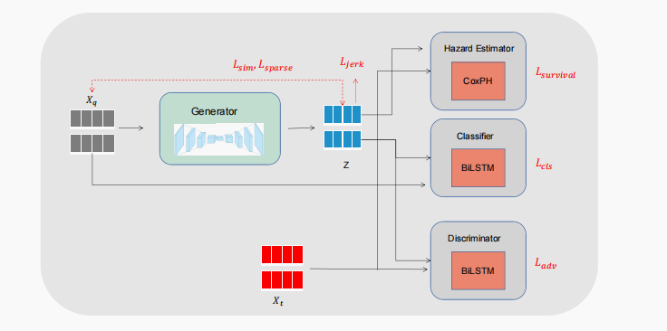
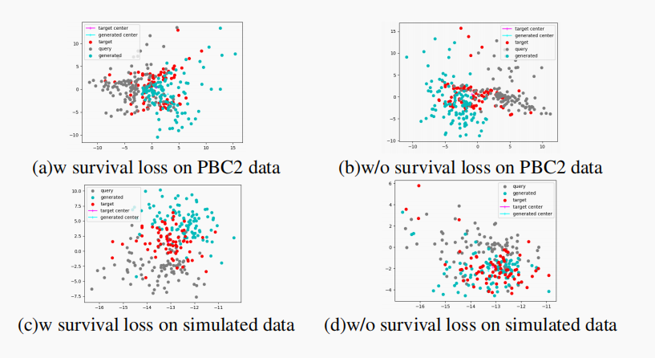
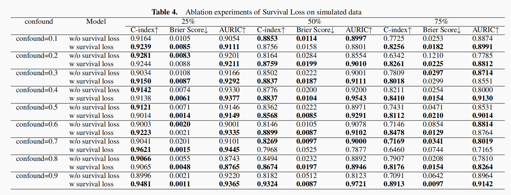

# CCS：Counterfactual attention with Counterfactual estimation for Survival analysis

Achieving interpretability in machine learning models remains a critical challenge in various domains. According to Holzinger,
counterfactual explanations can be defined as the minimal changes to
the feature values of input instances that would result in a predicted
outcome as predefined.

Our model is based on the hypothesis of counterfactual explanations summarized by: (1) Validity, ensured by optimizing the generated counterfactual explanation X to closely resemble the original factual data point X while achieving the desired
(classification) result; (2) Actionability, namely that the model can distinguish which features are changeable; (3) Sparsity, aiming to
change as few features as possible; (4) Manifold similarity, that is,
the generated counterfactual should be compared to the observed
data (training data) that the model has seen, rather than generating
a completely separate sample.

## Results

## Counterfactual Estimation

see detains in dir `./CFGan` , models in `CFGan\counterfactual_gan.py`, loss functions in `CFGan\loss_functions.py`

pretrained classifier in   `CFGan\train_classifier.py`

